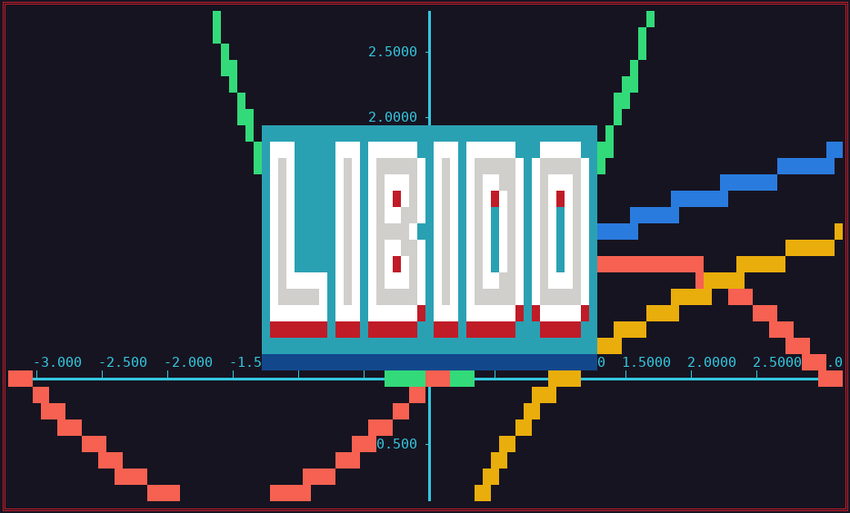

# **Libido - \<libido/\>**

A C math library.

1. [Installation](#installation)  
2. [Documentation](#documentation)  
	2.1. [Vector](#vector)
---
# **1. Installation**
1. Run install.sh, which copies the files to your include directory.
2. Compile using ./compile.sh.
---
# **2. Documentation**
---
## 2.1. **Vector** - <libido/vector.h>
### Types:
| Variable Type: | Members: | Description: |
| - | - | - |
| vec  | `double *val` - vector contents.   `int size` - vector size.  | This is the vector struct. All functions in vector.h operate on `vec`. It is identical to the struct `set` from `<libido/set.h>`. |

### Constructors:
| Function: | Arguments: | Description: |
| - | - | - |
| `vec vec_from_arr `| `double arr[]	` - source array.  `int size		` - source array size.  | Initialize a vector from a double array. |
| `vec vec_from_const `| `double cons	` - component value.  `int size		` - vector size.  | Initialize a vector with identical values. |
| `vec vec_gen `| `double min		` - first coefficient.  `double max		` - last coefficient.  `double inc		` - coefficient increment.  `double (*function)(double)	` - function on coefficient.  | Vector generating function meant for iteratively populating a vector. |

### Methods:
| Function: | Arguments: | Description: |
| - | - | - |
| `vec vec_fill `| `vec vec		` - target vector.  `double val		` - filler value.  | Fill a vector with identical values. |
| `vec vec_clear `| `vec vec			` - target vector.  | Nullify a vector. |
| `vec vec_mul_const `| `vec vec		` - vector factor.  `double mul		` - constant factor.  | Multiply a vector by a constant. |
| `vec vec_div_const `| `vec vec		` - vector divident.  `double div		` - constant divisor.  | Divide a vector by a constant. |
| `vec vec_add_const `| `vec vec		` - vector addend.  `double add		` - constant addend.  | Add a constant to each component of a vector. |
| `vec vec_sub_const `| `vec vec		` - vector minuend.  `double sub		` - constant subtrahend.  | Subtract a constant from each component of a vector. |
| `vec vec_unit `| `vec vec			` - target vector.  | Compute the unit vector of a select vector. |
| `vec vec_add `| `vec vec0		` - first addend.  `vec vec1		` - second addend.  | Add two vectors. |
| `vec vec_sub `| `vec vec0		` - minuend.  `vec vec1		` - subtrahend.  | Subtract two vectors. |
| `vec vec_hada `| `vec vec0		` - first factor.  `vec vec1		` - second factor.  | Compute the Hadamard product of two vectors. |
| `double vec_mag `| `vec vec			` - target vector.  | Compute the magnitude of a vector. |
| `double dot_prod `| `vec vec0		` - first factor.  `vec vec1		` - secdond factor.  | Compute the dot product of two vectors. |
| `double cross_prod_mag `| `vec vec0		` - first factor.  `vec vec1		` - second factor.  | Compute the cross product magnitude of two vectors. |

### Printers:
| Function: | Arguments: | Description: |
| - | - | - |
| `void vec_print `| `vec vec			` - target vector.  | Print a vector in vector notation. |
| `void vec_print_padded `| `vec vec		` - target vector.  `int padding		` - padding width.  | Print a vector in vector notation with padding. |
| `void vec_print_labeled `| `vec vec		` - target vector.  `char *label	` - vector label.  `int padding		` - padding width.  | Print a vector in vector notation with padding and a label. |
| `void good_dog `| `int dog			` - dog.  | Print the index of a good dog (not to be confused with bad_dog()). |
